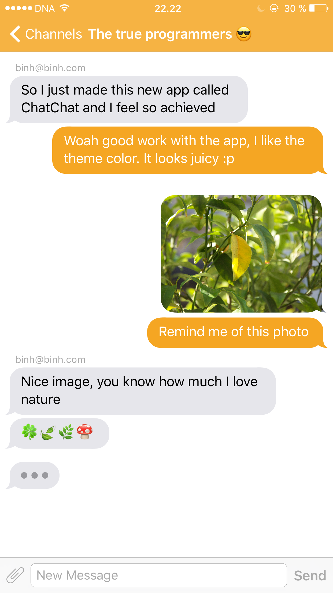

ChatChat
============

ChatChat is an iOS channel-based chat application, you can create custom named chat channels, send message/photos to your friends. 
The application was developed using Swift 3.

## Preview




## Dependencies
* [JSQMessageViewController](https://github.com/jessesquires/JSQMessagesViewController)
* [Firebase](https://firebase.google.com/)

## Requirements
* iOS 9.0+

## Installation
First make sure to have CocoaPod installed, then go the folder of the project and run: 
```bash
pod install 
```
Then you will need to have your own Firebase acccount and create a database for this particular project. 
1. Replace the GoogleService-Info.plist in the app with the one you downloaded from your Firebase DB
2. In line 31 in file ChatViewController.swift, replace the link in there with the link of your Firebase storage 
```swift 
lazy var storageRef: FIRStorageReference = FIRStorage.storage().reference(forURL: "gs://chatchat-iosapp-secourse.appspot.com/")
```
3. In your Firebase console, go to Authentication -> Sign-in Method -> Turn on Email/Password

## Usage
In order to use the application, the user must register for an account via email. The user is free to create or join any channels after logging in. 

## Contributing

Bug reports and pull requests are welcome on GitHub at <https://github.com/binhbui411/ChatChat-iOSApp>.
